# Grounded Cobot VLA

An integrated, fail-closed perception-to-manipulation pipeline for selecting an
object from a spoken or typed instruction, locating it with Grounding DINO and
SAM 3.1, converting ZED depth into an FR5 base-frame target, and planning a
pickup with ROS 2 and MoveIt.

The default workflow does **not** move the robot. It creates an audit image and
target file, then plans the complete pickup. Physical movement requires an
explicit `--execute` flag. There is no additional typed confirmation.

## Architecture

```mermaid
flowchart LR
    A[Typed text or Whisper] --> B[Command parser]
    B --> C[Sealed visual intent + SHA-256]
    C -->|POST /v1/segment| D[ZED 2i RGB + depth]
    D --> E[Grounding DINO<br/>bounded proposals]
    E --> F[SAM 3.1<br/>mask refinement]
    F --> G[Qwen2.5-VL 7B<br/>identity check]
    G --> H[Geometry + depth<br/>safety gates]
    H --> I[Pixel/depth to<br/>camera XYZ]
    I --> J[Calibrated camera<br/>to FR5 base XYZ]
    J --> K[Audit PNG +<br/>versioned target JSON]
    K --> L[MoveIt plan only]
    L -->|--execute| M[FR5 motion]
```



The integrated robot path uses the bounded `./sam3-dino` service:

1. `VLA_project` converts text or Whisper speech into a constrained pick
   command.
2. The bridge creates a versioned visual intent and SHA-256 identity hash.
3. The ZED 2i captures a fresh HD720 RGB/depth frame.
4. Grounding DINO proposes at most three open-vocabulary boxes.
5. SAM 3.1 refines each box into a mask.
6. Qwen2.5-VL compares the raw frame, numbered mask overlays, mask zooms, clean
   crops, the structured prompt, and measured candidate geometry. It must return
   zero or one best mask; pixel/depth selectors are checked deterministically.
7. Mask geometry, workspace, depth coverage, physical-size, and
   calibration-envelope gates must all pass. The final SAM mask centroid is
   used for image X/Y with robust masked-median depth for Z; proposal-box center
   is retained only as audit evidence.
8. The selected center point is transformed from `zed_left_optical` into
   `base_link`, then written to `/tmp/fr5_vla_target.json` with an audit image.
9. ROS 2/MoveIt plans the hover and pickup. Execution remains a separate,
   explicit action.

This split is deliberate: neural models choose and segment the object, while
deterministic code owns identity attestation, geometry, coordinate transforms,
safety thresholds, target-file creation, and permission to proceed.

## Repository layout

| Path | Purpose |
| --- | --- |
| `scripts/` | Perception service, DINO/SAM/Qwen adapters, depth logic, evaluation tools |
| `sam3-dino` | Main bounded perception service launcher and client |
| `sam3` | Experimental v1/v2 SAM service retained for evaluation; not the robot default |
| `robot_ws/` | ROS 2 Jazzy overlay, FR5 MoveIt bringup, calibration, planning, execution |
| `VLA_project/` | Lightweight typed/voice command and transcript package |
| `evaluation/` | Offline language, geometry, parity, and release-gate fixtures |
| `docs/PERCEPTION.md` | Detailed perception API, rollout gates, and evaluation commands |
| `GROUNDING_DINO_PIPELINE.md` | Bounded DINO proposal and mask-refinement details |

Model weights, Hugging Face caches, virtual environments, perception outputs,
and ROS `build/`, `install/`, and `log/` directories are intentionally ignored.

## Supported and tested environment

The current hardware integration targets:

- Ubuntu 24.04 with [ROS 2 Jazzy](https://docs.ros.org/en/jazzy/Installation/Ubuntu-Install-Debs.html)
  on 64-bit ARM or x86_64;
- Python 3.12;
- an NVIDIA CUDA-capable machine with a platform-correct PyTorch build;
- a Stereolabs ZED 2i with the
  [ZED SDK and Python API](https://docs.stereolabs.com/docs/development/api-languages/python);
- a Fairino FR5 reachable at the driver-configured controller address;
- the external `fairino_ros_connector` checkout containing
  `fairino_description`, `fairino_hardware_v3_9_6`, and the taught plan DB.

The local validated environment uses PyTorch 2.12.1, Transformers 5.12.1,
SAM 3.1, Grounding DINO Base, Qwen2.5-VL-7B-Instruct, and ROS 2 Jazzy. The
upstream SAM project currently requires Python 3.12+, PyTorch 2.7+, and CUDA
12.6+; follow its [official installation notes](https://github.com/facebookresearch/sam3#installation)
when building a different platform.

## Installation

### 1. Clone

```bash
git clone https://github.com/S-kalakota/SAM_3_implementation.git grounded-cobot-vla
cd grounded-cobot-vla
```

### 2. Install the platform PyTorch and ZED runtime

Install the CUDA/Jetson PyTorch build appropriate to the host before running
the setup script. Do not replace a working NVIDIA ARM64 build with an x86-only
PyPI wheel.

Install the ZED SDK and its Python wrapper, then verify the camera and CUDA
runtime:

```bash
python3 -c 'import pyzed.sl; print("ZED Python API OK")'
python3 -c 'import torch; print(torch.__version__, torch.cuda.is_available())'
```

### 3. Set up perception and command dependencies

```bash
./scripts/setup_perception.sh
```

The script creates `.venv` with access to platform system packages, checks that
PyTorch exists, clones the SAM source at the tested revision into ignored
`third_party/sam3`, and installs the perception and command packages. It does
not download gated weights.

### 4. Download model assets

Request and accept access to Meta's gated
[SAM 3.1 model](https://huggingface.co/facebook/sam3.1), then authenticate:

```bash
.venv/bin/hf auth login
```

Download the exact assets expected by `sam3-dino`:

```bash
.venv/bin/hf download facebook/sam3.1 \
  sam3.1_multiplex.pt config.json \
  --local-dir checkpoints/sam3.1

.venv/bin/hf download Qwen/Qwen2.5-VL-7B-Instruct
./sam3-dino cache-dino
```

The final paths/caches must include:

```text
checkpoints/sam3.1/sam3.1_multiplex.pt
third_party/sam3/sam3/
${HF_HOME:-$HOME/.cache/huggingface}/hub/models--Qwen--Qwen2.5-VL-7B-Instruct/
${HF_HOME:-$HOME/.cache/huggingface}/hub/models--IDEA-Research--grounding-dino-base/
```

Grounding DINO Base and Qwen2.5-VL are loaded through Transformers from the
local Hugging Face cache. Normal camera requests run with Hugging Face and
Transformers offline mode enabled, so a request cannot unexpectedly download a
model.

### 5. Connect the Fairino ROS packages

The Fairino driver is an external dependency and is not copied into this repo.
Point the helper at its checkout:

```bash
export FAIRINO_CONNECTOR_ROOT="$HOME/fairino_ros_connector"
./robot_ws/scripts/link_fairino_packages.sh
```

The helper creates ignored, local symlinks for `fairino_description` and
`fairino_hardware_v3_9_6` plus the matching `fairino_msgs`; it refuses to
replace an existing path. Keeping the hardware and message packages from the
same connector checkout avoids ABI/schema mismatches with older ROS underlays.

Install ROS dependencies and build:

```bash
source /opt/ros/jazzy/setup.bash
cd robot_ws
rosdep install --from-paths src --ignore-src -r -y
colcon build --packages-select \
  fairino_msgs fairino_description fairino_hardware_v3_9_6 fr5_bringup \
  --allow-overriding fairino_msgs fairino_description
source install/setup.bash
cd ..
```

## Calibration

`robot_ws/calib/` contains the accepted calibration for the original physical
camera/FR5 installation. It is **not portable to a remounted camera, another
robot, or another lens/resolution configuration**. The loader verifies the
source-point hash and rejects failed calibration records, but it cannot know
whether hardware has physically moved.

For a new installation, stop perception so the calibration tool can own the
ZED camera, bring up the robot, capture at least eight well-spread 3D
correspondences, and fit the rigid transform:

```bash
./sam3-dino stop
source /opt/ros/jazzy/setup.bash
source robot_ws/install/setup.bash

ros2 run fr5_bringup b1_capture_points.py
ros2 run fr5_bringup b2_fit_transform.py --write
```

Inspect the printed RMS/max residuals and the generated
`robot_ws/calib/T_base_cam.json` before using it. See `Second_plan.md` and
`robot_ws/Second_plan.md` for the original calibration milestones.

## Run the program

### Perception-only smoke test

This path opens the camera and performs no robot operation:

```bash
./sam3-dino start
./sam3-dino status
./sam3-dino "the orange and grey box"
```

Useful lifecycle commands:

```bash
./sam3-dino logs
./sam3-dino restart
./sam3-dino stop
```

Only one process may own the ZED camera. Stop the standard `./sam3` service,
ZED RTSP service, viewers, or calibration tools before starting `sam3-dino`.

### Complete integrated run, defaulting to no motion

Terminal 1, from the repository root:

```bash
./robot_ws/scripts/start_vla_pickup.sh
```

This releases a system-managed ZED RTSP service if necessary, starts and checks
Grounding DINO/SAM/Qwen, builds the ROS overlay, connects the real FR5 driver,
and launches MoveIt. It does not command a trajectory.

Terminal 2:

```bash
./robot_ws/scripts/run_vla_pickup.sh \
  "pick up the grey and orange box"
```

The runner waits for live joints, captures a fresh frame, produces and opens an
audit image, writes a checked target, and plans the complete pickup. It then
exits without moving the arm.

Review these artifacts after every request:

```bash
xdg-open /tmp/fr5_vla_target_audit.png
jq . /tmp/fr5_vla_target.json
```

### Physical execution

Physical execution is experimental. Clear the entire workspace, start from a
known pose, verify the calibration and audit overlay, review the printed pickup
plan, and keep a hand on the e-stop. Then run:

```bash
./robot_ws/scripts/run_vla_pickup.sh --execute \
  "pick up the grey and orange box"
```

Supplying `--execute` starts motion immediately after target creation and a
successful motion preflight; there is no typed `PICK` prompt. The pickup
executor retains its internal 100 mm approach waypoint, then descends, grasps,
retreats, and returns through the validated trajectory sequence without a
separate hover pause. A clean empty close triggers up to two retries, 10 mm
deeper each time, for three total default contact depths of 5, 15, and 25 mm.
The fingertip TCP also receives a fixed 47 mm downward correction in
`base_link`. This correction is strictly `[0, 0, -0.047]` metres and therefore
cannot shift the detected object center in X or Y when the wrist is tilted. It
does not alter the wrist-to-TCP calibration. Override it with
`--fingertip-down-offset-mm` on `d0_point_grab.py`.

A close that remains above 95% open is treated as side contact or target
misalignment, not a successful grasp. The executor reopens before retreat and
does not make a deeper retry from that unsafe outcome. A verified grasp must
stop between 68% and 95% with the default close command and obstruction delta.

### Voice input

Install the optional voice dependencies and SoX, then call the no-motion target
bridge directly while the DINO service is running:

```bash
.venv/bin/pip install -e "VLA_project[voice]"
sudo apt install sox

.venv/bin/python robot_ws/src/fr5_bringup/scripts/vla_pick_target.py \
  --voice --voice-duration 5
```

Voice and text use the same downstream identity, perception, calibration, and
depth gates.

## Outputs and contracts

Perception requests are stored under `outputs/service/<timestamp>/`. Important
files include the captured frame, DINO proposals, candidate crops, SAM masks,
Qwen verification, depth statistics, overlay, and final `result.json`.

The robot bridge writes:

- `/tmp/fr5_vla_target_audit.png` — target box, center, depth, and base XYZ;
- `/tmp/fr5_vla_target.json` — schema-1 surface target consumed by hover/pick;
- `/tmp/fr5_vla_target.json` only after every required gate passes.

A rejected request does not overwrite the target, so an older file may still
exist. Always check its `created` timestamp or use the runner, which enforces a
fresh-frame age.

## Safety behavior

The default DINO path is fail-closed and requires:

- schema-valid intent with a request/response SHA-256 identity match;
- no unsupported source-region or relational semantics;
- at most three DINO proposals and a schema-constrained Qwen result containing
  zero or one final mask;
- Qwen identity confidence of at least `0.70`;
- SAM presence score of at least `0.10`;
- mask area below `25%` of the workspace crop;
- at least `80%` valid depth and 20 valid depth pixels;
- a valid object-center target using robust masked-median depth (depth spread
  is retained as evidence but is not a rejection boundary);
- plausible projected object size and calibrated camera/base envelopes;
- base-surface height within the calibrated workspace;
- agreement between back-projected and service-provided camera XYZ.

The unbounded SAM/Qwen agent fallback is disabled for robot target creation.
`--agent-fallback` exists only for deliberate diagnostics.

## What works well

- Open-vocabulary object descriptions and simple attributes such as colors.
- One spatial selector: leftmost, rightmost, topmost, bottommost, nearest,
  farthest, largest, or smallest.
- Conservative rejection of ambiguous masks, stale frames, weak depth, and
  inconsistent coordinate evidence.
- Depth-discontinuity trimming that reduces masks spilling onto a table or
  neighboring object when the ZED evidence is reliable.
- Reproducible artifacts for every perception decision.
- Plan-only operation by default; `--execute` is the explicit motion opt-in.
- Offline unit coverage for intent contracts, proposal geometry, mask/depth
  gates, relation geometry, release gates, command parsing, and robot-target
  construction.

## Current limitations

- The checked-in camera-to-base calibration is valid only for the original
  physical rig and HD720 setup.
- The robot path supports attributes and one spatial selector, but relational
  requests such as “inside the bin” or source-region requests fail closed.
- The 7B verifier and SAM 3.1 checkpoint need substantial GPU/unified memory;
  CPU-only execution is not a practical live-robot configuration.
- The ZED camera is single-owner, and model warmup can take several minutes.
- The Docker file depends on a site-specific
  `fairino-plan-executor:thor-arm64` base image. The host `.venv` launcher is
  the documented path for a fresh clone.
- The Fairino driver, taught `plans.sqlite`, controller setup, and gripper
  hardware remain external dependencies.
- MoveIt currently has no complete environment collision scene. Planning alone
  does not prove a physical path is safe.
- Pickup uses a narrow experimental surface-target/gripper routine; it is not a
  general grasp planner and does not estimate object pose or bin walls.
- Hardware-in-the-loop behavior cannot be covered by ordinary CI. Unit and
  offline evaluation tests do not replace a supervised site acceptance test.

## Validation

Run the offline suites without opening the camera or commanding the robot:

```bash
.venv/bin/python -m pytest -q tests
.venv/bin/python -m pytest -q VLA_project/tests
PYTHONPATH=robot_ws/src/fr5_bringup/scripts \
  .venv/bin/python -m pytest -q \
  robot_ws/src/fr5_bringup/test/test_vla_pick_target.py
```

After building the ROS overlay:

```bash
source /opt/ros/jazzy/setup.bash
source robot_ws/install/setup.bash
cd robot_ws
colcon test --packages-select fr5_bringup
colcon test-result --verbose
cd ..
```

The extended frozen-scene, language, relation, parity, and release-gate
workflows are documented in `docs/PERCEPTION.md` and `evaluation/README.md`.

## Troubleshooting

- **`Grounding DINO is not cached`** — run `./sam3-dino cache-dino` with
  network access, then start again.
- **`Qwen 7B cache not found`** — run the Qwen `hf download` command under the
  same `HF_HOME` used at runtime.
- **`shared SAM checkpoint/source not found`** — rerun setup and place the
  gated checkpoint at `checkpoints/sam3.1/sam3.1_multiplex.pt`.
- **camera open/busy error** — stop `./sam3`, `zed-rtsp.service`, ZED viewers,
  and calibration processes; inspect owners with `fuser -v /dev/video0
  /dev/video1`.
- **Fairino package missing** — set `FAIRINO_CONNECTOR_ROOT` and rerun
  `robot_ws/scripts/link_fairino_packages.sh`.
- **duplicate hardware plugin** — set `LEGACY_FAIRINO_PREFIX` if the older
  plugin is installed somewhere other than `$HOME/ros2_ws`.
- **stale target refusal** — keep the scene still and rerun the complete
  command; do not manually reuse the previous `/tmp/fr5_vla_target.json`.
- **nonstandard clone location** — repository discovery is automatic. Set
  `GROUNDED_COBOT_ROOT` or `FR5_CALIB_DIR` only for a detached install layout.

## Further documentation

- `GROUNDING_DINO_PIPELINE.md` — DINO thresholds, candidate flow, and artifacts
- `docs/PERCEPTION.md` — standard/v2 service and evaluation details
- `robot_ws/VLA_INTEGRATION.md` — robot bridge contract and manual workflow
- `V2_API.md` — experimental version-2 perception API
- `evaluation/README.md` — evaluation manifests and scoring

This repository contains project integration code and retains its existing
proprietary package declaration. Upstream SAM, Grounding DINO, Qwen, ZED, ROS,
MoveIt, and Fairino components remain subject to their own licenses and access
terms.
